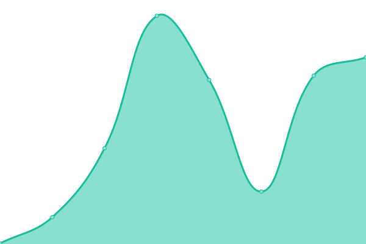
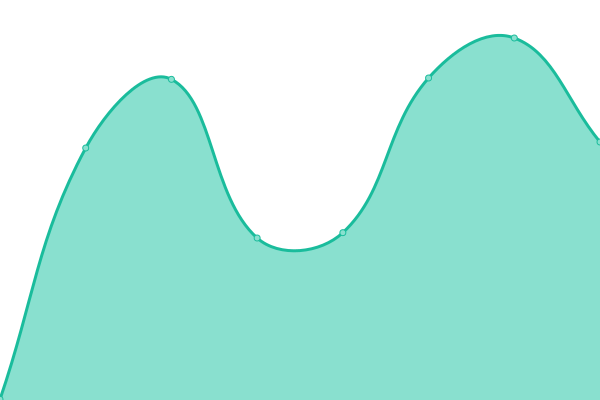

# [📈 Live Status](https://status.w3dev.cloud): <!--live status--> **🟧 Partial outage**

This repository contains the open-source uptime monitor and status page for [W3 Dev](https://w3dev.in), powered by [Upptime](https://github.com/upptime/upptime).

With [Upptime](https://upptime.js.org), you can get your own unlimited and free uptime monitor and status page, powered entirely by a GitHub repository. We use [Issues](https://github.com/W3Dev/uptime/issues) as incident reports, [Actions](https://github.com/W3Dev/uptime/actions) as uptime monitors, and [Pages](https://status.w3dev.cloud) for the status page.

<!--start: status pages-->
<!-- This summary is generated by Upptime (https://github.com/upptime/upptime) -->
<!-- Do not edit this manually, your changes will be overwritten -->
<!-- prettier-ignore -->
| URL | Status | History | Response Time | Uptime |
| --- | ------ | ------- | ------------- | ------ |
|  [W3Dev Home](https://w3dev.in) | 🟩 Up | [w3-dev-home.yml](https://github.com/W3Dev/uptime/commits/HEAD/history/w3-dev-home.yml) | 

 441ms
     
 | 

<a href="https://status.w3dev.cloud/history/w3-dev-home">97.31%</a>
    

|  [Wikipedia](https://en.wikipedia.org) | 🟩 Up | [wikipedia.yml](https://github.com/W3Dev/uptime/commits/HEAD/history/wikipedia.yml) | 

 169ms
     
 | 

<a href="https://status.w3dev.cloud/history/wikipedia">100.00%</a>
    

|  [Hacker News](https://news.ycombinator.com) | 🟩 Up | [hacker-news.yml](https://github.com/W3Dev/uptime/commits/HEAD/history/hacker-news.yml) | 

 282ms
     
 | 

<a href="https://status.w3dev.cloud/history/hacker-news">100.00%</a>
    

|  [Test Broken Site](https://thissitedoesnotexist.koj.co) | 🟥 Down | [test-broken-site.yml](https://github.com/W3Dev/uptime/commits/HEAD/history/test-broken-site.yml) | 

 0ms
     
 | 

<a href="https://status.w3dev.cloud/history/test-broken-site">100.00%</a>
    

<!--end: status pages-->

[**Visit our status website →**](https://status.w3dev.cloud)

## 📄 License

- Powered by: [Upptime](https://github.com/upptime/upptime)
- Code: [MIT](./LICENSE) © [W3 Dev](https://w3dev.in)
- Data in the `./history` directory: [Open Database License](https://opendatacommons.org/licenses/odbl/1-0/)
